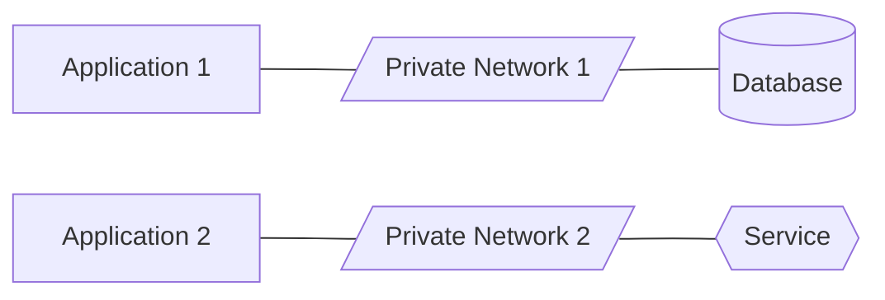
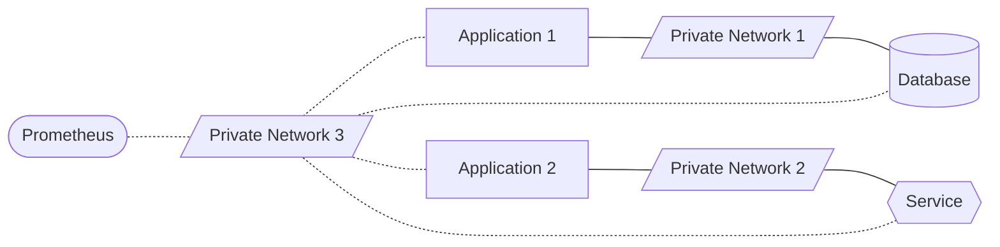
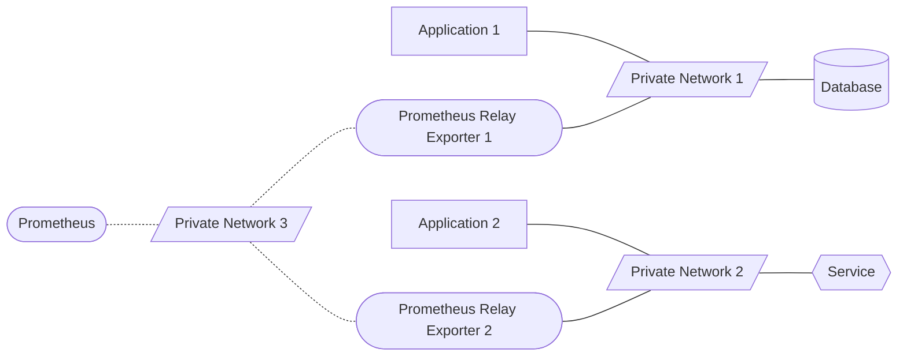

# Use Case

To demonstrate the use case of the Prometheus relay exporter, consider the
following example initial scenario:

There are two applications running on their own private networks, one
connected to a database and the other to a supporting service.

In this scenario, it is fundamental to keep both applications **isolated**.

The above deployment can be easily modelled using two Docker Compose stacks
running in a Docker Swarm cluster. In this case, each application and
their associated services can run in their own isolated overlay network.

Now, suppose that you want to add metrics monitoring using a Prometheus
instance also on its own private network:

In this new scenario, it becomes clear that neither the applications nor
their services are isolated anymore. All the participating components are
now unavoidably interconnected through the *Private Network 3*.

To solve this situation, we can use the Prometheus relay exporter as a
sidecar in each application stack:

In this final scenario, both applications and their services **remain isolated again**.

The Prometheus relay exporter in the above architecture offers the following benefits:

* Application stacks can be monitored using Prometheus without breaking isolation anywhere.
* Metrics exporter ports in applications and services do NOT need to be exposed publicly.
* Automatic discovery of containers to scrape can be achieved using the
  [Docker service discovery](https://prometheus.io/docs/prometheus/latest/configuration/configuration/#docker_sd_config)
  mechanism in Prometheus.
  * In this case, original container label metadata can be directly preserved via Prometheus relabelling.

Refer to the provided [examples](examples/) for more information.
